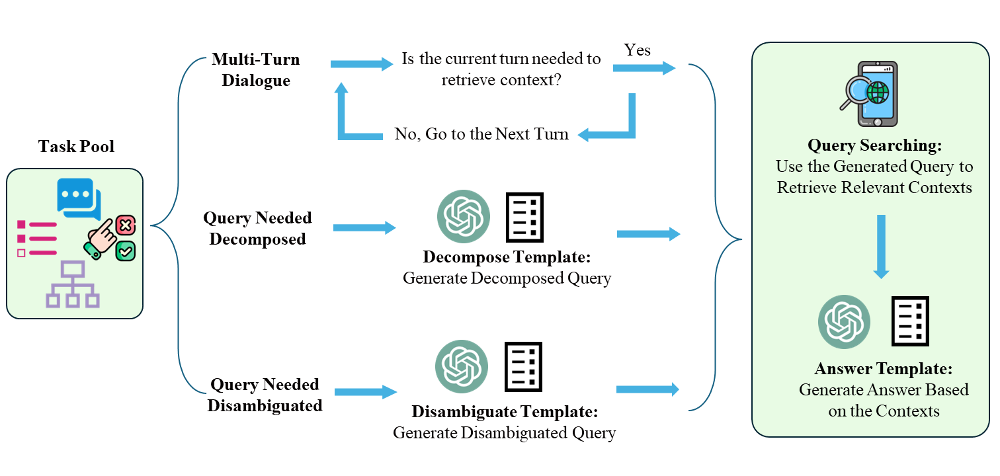

# RQ-RAG: Learning to Refine Queries for Retrieval Augmented Generation

This is the repo of our paper "RQ-RAG: Learning to Refine Queries for Retrieval Augmented Generation"

## Announcement
We are excited to announce that our paper has been accepted to the Conference on Language Modeling (COLM) 2024. Thank you for your interest and support!

If you find our paper useful, please consider cite our paper:

```
@article{chan2024rq,
  title={Rq-rag: Learning to refine queries for retrieval augmented generation},
  author={Chan, Chi-Min and Xu, Chunpu and Yuan, Ruibin and Luo, Hongyin and Xue, Wei and Guo, Yike and Fu, Jie},
  journal={arXiv preprint arXiv:2404.00610},
  year={2024}
}

```


## Release

We are also releasing the curated dataset, and the trained Llama2-7B checkpoint, you can download it here; [dataset](https://huggingface.co/datasets/zorowin123/rq_rag),
 [checkpoint](https://huggingface.co/zorowin123/rq_rag_llama2_7B).


## Getting Start


1. Installation

Clone this repository first, and install the dependencies.

```
git clone git@github.com:chanchimin/RQ-RAG.git
cd RQ-RAG
pip install -r requirements.txt
```

2. Construct Search-Augmented Dataset

First, set up your openai api key
```
export OPENAI_API_KEY="your_api_key_here"
```

Second, preprocess your data to the following format

```python
# for multi-turn data， your data should contain messages format, an example:

{
    "id": ...,
    "messages":
        [
            {   
                "role":"user",
                "content": ...,
            },
            {
                "role":"assistant",
                "content": ...,
            }
        ]
}
```

Afterward, execute the following lines, make sure to substitute your data path.

```shell
cd ./data_curation

python main_multiturn_answer_generate.py \
--raw_data_path_multiturn  \
"your file" \
--ndocs  \
3  \
--output_path  \
"your output_path" \
--search_engine_type  \
duckduckgo  \
--openai_api_key  \
"your key" \
--overwrite_output
```

After gathering the intermediate results, run:

```shell
python merge_intermediate.py \
--raw_data_path \
"intermediate data path" \
--output_path \
"final data output path"
```



3. Train the model
```shell
cd ..
bash retrieval_lm/scripts/train/script_finetune_7b.sh
```

4. Inference and Sample the results

```shell
# take hotpotqa as an example
# first inference the model, all the trajectory will be saved to "your_output_dir/final_results.json"
bash retrieval_lm/scripts/inference/search_engine/hotpotqa.sh
# then do the sample
bash retrieval_lm/scripts/sample_from_tree/hotpotqa.sh
```
